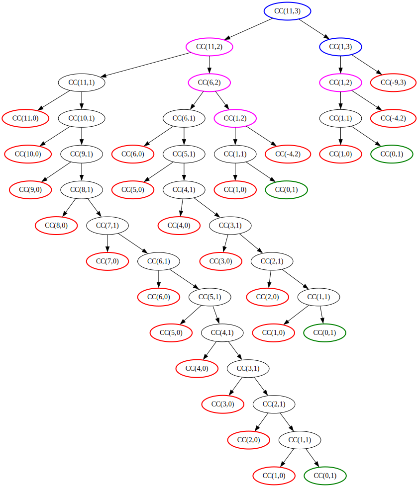

# Exercise 1.14

The tree was generated by Graphviz. The DOT file generation is implemented in C++ because I feel more comfortable using it. Could probably be translated into Scheme easily. Or just draw this tree by hand.

## Space Complexity

Since the process is a recursion tree, the space cost is proportional to the maximum depth of this tree.

Notice that the most inefficient way to make change is by only using pennies. The path in the tree to this exact solution is as follows: first remove the other $n-1$ coins, and then add $a$ pennies to the solution. In total, we visit $a+n$ nodes on this path, which is $\Theta(a)$.

## Time Complexity

Let $T(a,n)$ be the number of nodes visited by the process $\text{CC}(a,n)$.

The base case is $T(a,0)=1$.

Consider a node $T(a,1)$. The process is then linear, as we repeatedly add a penny to the solution, exactly $a$ times, and for each such node the other subtree has only $T(a,0)=1$ node. In total, we visit $2a+1$ nodes (the penny nodes, the no coins nodes, and the root node). Hence

$$T(a,1)=2a+1.$$

Now, consider a node $T(a,2)$. We can use at most $\left\lfloor \frac{a}{5}\right\rfloor$ nickels until we get either zero or negative value, so there are at most $\lfloor \frac{a}{5}\rfloor + 2$ such nodes in the whole tree (number of subtractions + root). From any such node, we can either go to the subtree $T(a,1)$, or subtree $T(a-5,2)$. Hence

$$T(a,2)=\left\lfloor \frac{a}{5} \right\rfloor + 2 + \sum_{i=1}^{\left\lfloor \frac{a}{5} \right\rfloor + 1} T(a-5(i-1),1)$$

Calculating the exact formula will be tedious, but fortunately we are only concerned with the asymptotic complexity.

$$T(a,2)=\Theta(a) + \sum_{i=1}^{\left\lfloor \frac{a}{5} \right\rfloor + 1} \Theta(a) = \Theta(a) + \Theta(a) \cdot \Theta(a) = \Theta(a^2)$$

Similar reasoning can be used for the other coins.

$$T(a,3)=\left\lfloor \frac{a}{10} \right\rfloor + 2 + \sum_{i=1}^{\left\lfloor \frac{a}{10} \right\rfloor + 1} T(a-10(i-1),2) = \Theta(a) + \Theta(a) \cdot \Theta(a^2) = \Theta(a^3)$$

$$T(a,4)=\left\lfloor \frac{a}{25} \right\rfloor + 2 + \sum_{i=1}^{\left\lfloor \frac{a}{25} \right\rfloor + 1} T(a-25(i-1),3) = \Theta(a^4)$$

$$T(a,5)=\left\lfloor \frac{a}{50} \right\rfloor + 2 + \sum_{i=1}^{\left\lfloor \frac{a}{50} \right\rfloor + 1} T(a-50(i-1),4) = \Theta(a^5)$$

Thus, in general, we have $T(a,n)=\Theta(a^n)$.
