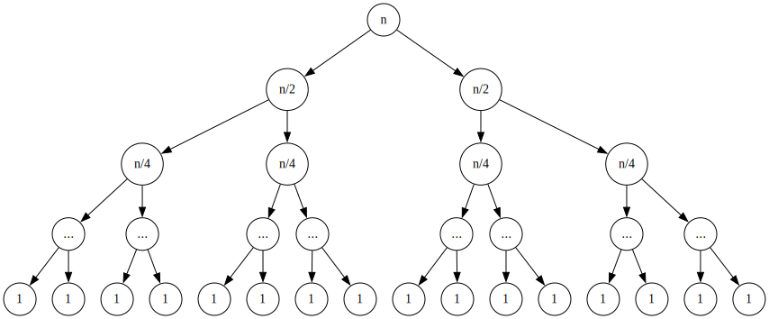

# Exercise 1.26

Replacing `(square (...))` with `(* (...) (...))` nullifies the point of the fast exponentiation algorithm, as it calculates $a^{n/2} \mod n$ twice. The recursion is now non-linear.

Consider a recursion tree for $n = 2^k$. Let $T(n)$ be the number of multiplications for exponent $n$.

$$T(1)=1$$
$$T(n) = T(n/2)+T(n/2)+1$$

The tree is a full complete binary tree with height $\log n$.
A complete binary tree with height $h$ has $2^{h-1}$ leaves.
So it has $2^{h-1}-1$ non-leaf nodes.
Therefore, in total, the tree has $2^h-1 = n-1=\Theta(n)$ nodes.
Since we preform a multiplication at each node, $T(n)=\Theta(n)$.

## Some facts about trees

**Fact.** A full binary tree, i.e. a tree in which each node has either $0$ or $2$ children, with $n$ non-leaf nodes has $n+1$ leaves.

**Proof.**
A tree with $0$ non-leaf nodes has $1$ leaf.
Consider a tree with $n$ non-leaf nodes,
and replace a leaf node with a non-leaf node. This operation increases the number of both non-leaf nodes and leaf nodes by 1. $\blacksquare$

**Fact.** A complete binary tree,
i.e. a tree in which every level is completely filled,
with $h>0$ levels has $2^{h-1}$ leaves.

**Proof.** A tree with $1$ level has only $1$ node. Consider a tree with height $h$.
To add another level, we must add two children to each leaf,
which effectively doubles the total number of leaves. $\blacksquare$

By combining the two facts,
we conclude that a complete tree with height $h$ must have $2^h-1$ nodes.
